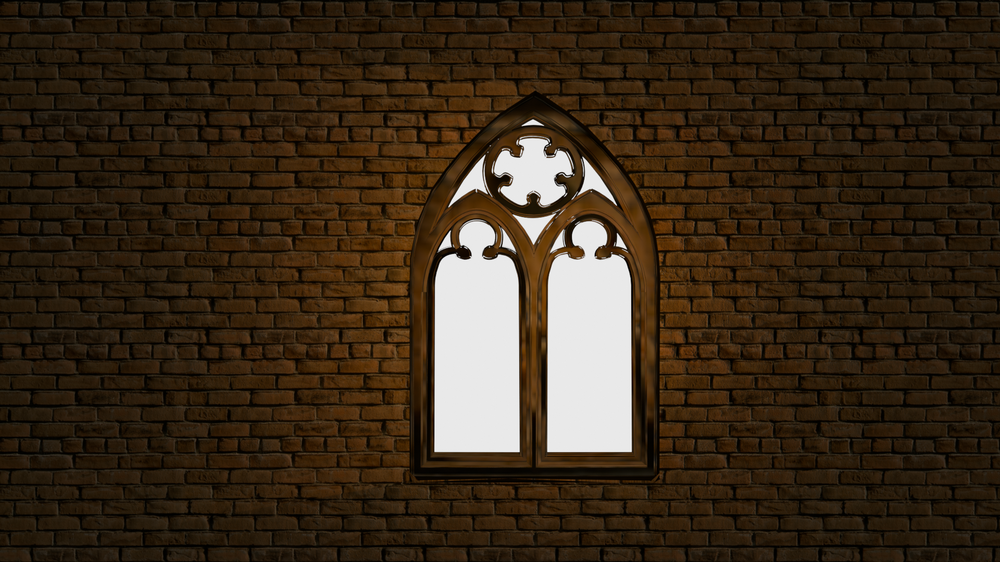
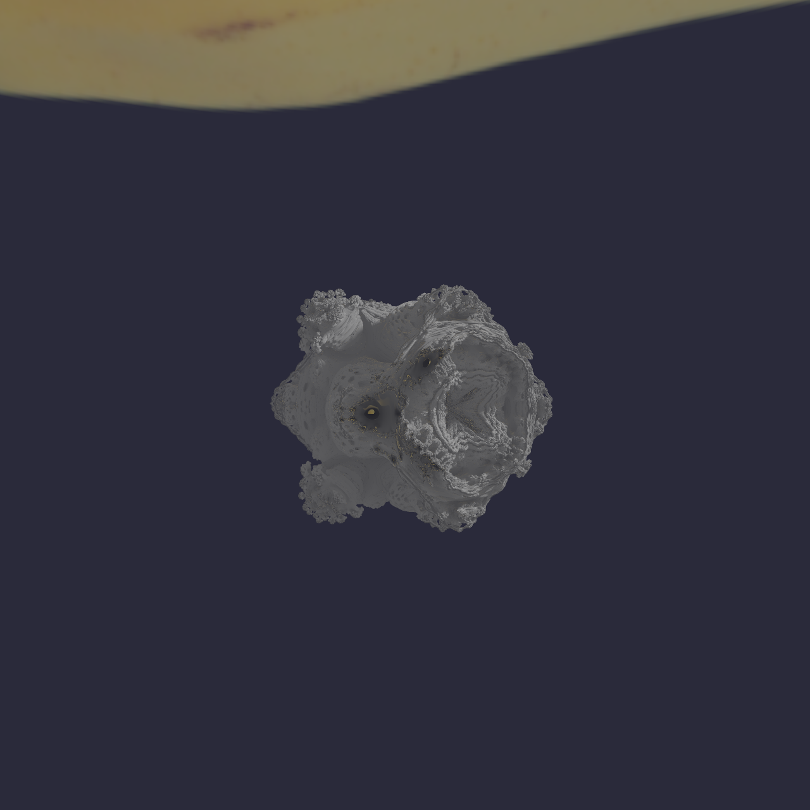
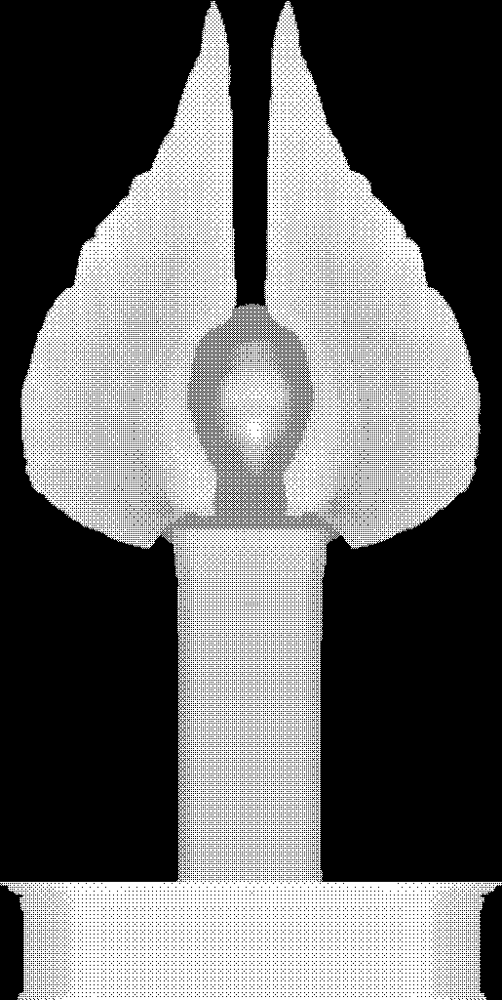
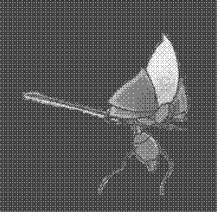

# TD MCP — TouchDesigner MCP Server

> An MCP server that bridges AI agents to a live TouchDesigner session over its WebServer DAT — so an agent can run Python, build and wire operators, read errors, capture the rendered output, and snapshot/restore networks without ever touching the TD UI.



## What it is

`td-mcp-server` is a [Model Context Protocol](https://modelcontextprotocol.io) server written in Node (ESM, `@modelcontextprotocol/sdk`). It speaks **stdio** to the AI host (Claude, Antigravity/Gemini, etc.) on one side and **HTTP** to a running TouchDesigner instance on the other.

The TD side is a **WebServer DAT** listening on `localhost:9980`. The server never pokes TD's process directly — every operation is an HTTP request that the WebServer DAT's callback handler executes inside the live project. That means edits mutate the **running, unsaved** session immediately; they are not persisted to the `.toe` on disk until the project is saved (the server's own instructions enforce a save → edit → verify → save discipline).

```
AI host  ──stdio──>  td-mcp-server (index.js)  ──HTTP :9980──>  TouchDesigner WebServer DAT
                          │                                          │
                          │                                          └─ webserver_callbacks.py
                          ├─ td-bridge.js   (HTTP client)               (/execute /errors /operator
                          ├─ api-validator.js (TD API DB check)          /screenshot /image_stats /chop /health)
                          └─ checkpoints.js (.tox snapshots)
```

## Capabilities / Tools

All tools below are exposed by `td-mcp-server/index.js`.

### Scripting & validation
| Tool | What it does |
|------|--------------|
| `execute_script` | Run a Python script inside TD, wrapped in an undo block. Returns stdout plus any Error-DAT errors and pre-execution validation warnings. |
| `validate_script` | Check a Python script against the bundled TD API database **without executing** it (flags unnecessary imports and invalid API usage). |
| `get_errors` | Read the current Error DAT table (recent Python errors). |

### Operator / network editing
| Tool | What it does |
|------|--------------|
| `create_operator` | Create a new operator under a parent COMP (e.g. `noise`, `constant`, `baseCOMP`, `text`, `geo`). |
| `delete_operator` | Destroy an operator by path. |
| `connect_operators` | Wire one operator's output to another's input (operator and COMP connections). |
| `disconnect_operators` | Disconnect a wire from an operator's input or output connector. |
| `get_operator_info` | Get name, type, family, parameters (value + mode), connections, and child count for an operator. |
| `list_operators` | List the child operators of a COMP path. |
| `get_par_value` | Read a single parameter value. |
| `set_par_value` | Set a single parameter value (numeric or string). |

### Visual feedback & tone analysis
| Tool | What it does |
|------|--------------|
| `take_screenshot` | Save a TOP's current frame as PNG and return it inline so the agent can *see* the output. Defaults to `/project1/out1`. |
| `analyze_image_tone` | Read row/column average CHOPs, compute R/G/B/A + luminance stats, evaluate the configured tone rules, and return matched conditions with the skill to apply. |
| `set_tone_rule` | Add or update a tone rule (channel/stat thresholds → skill) in `tone-rules.json`. |
| `list_tone_rules` | List all configured tone rules and their thresholds. |

### Checkpoints (`.tox` snapshots)
| Tool | What it does |
|------|--------------|
| `save_checkpoint` | Snapshot a COMP to a named `.tox` checkpoint — use before risky experiments. |
| `restore_checkpoint` | Destroy the current op at the saved path and reload the `.tox` snapshot. |
| `list_checkpoints` | List saved checkpoints (name, op path, description, timestamp). |
| `delete_checkpoint` | Remove a checkpoint and its `.tox` file from disk. |

### Resources
| URI | What it returns |
|-----|-----------------|
| `td://api/classes` | The full TouchDesigner API class list + metadata. |
| `td://api/class/{name}` | Resolved API info for a single TD class. |

## Setup / Run

### 1. TouchDesigner side (the bridge)
Set up the WebServer DAT that the server talks to (see `touchdesigner/webserver_callbacks.py`):

1. Create a **WebServer DAT**, set **Port** to `9980` and **Active** to On.
2. Create a **Text DAT** and paste the contents of `touchdesigner/webserver_callbacks.py` into it.
3. Point the WebServer DAT's **Callbacks DAT** at that Text DAT.
4. Create an **Error DAT** named `error1` to capture Python errors.

The callback handler routes `POST /execute`, `GET /errors`, `GET /operator`, `GET /screenshot`, `GET /image_stats`, `GET /chop`, and `GET /health`.

### 2. Server side (Node)
```bash
cd td-mcp-server
npm install
npm start            # node index.js  — the MCP server (stdio)
```

Other scripts in `package.json`:
- `npm run start:a2a` — `node a2a-server.js` (Agent-to-Agent variant)
- `npm run client` — `node a2a-client.js`

### 3. Register with your MCP host
The server is configured in `.mcp.json`:

```json
{
  "mcpServers": {
    "touchdesigner": {
      "command": "node",
      "args": ["<repo>/td-mcp-server/index.js"],
      "env": {
        "TD_API_DB": "<repo>/td_python_api.json",
        "TD_HOST": "127.0.0.1",
        "TD_PORT": "9980"
      }
    }
  }
}
```

Environment variables:
- `TD_HOST` / `TD_PORT` — where the WebServer DAT listens (default `localhost:9980`).
- `TD_API_DB` — path to the TD Python API database used for `validate_script` and the API resources.

## Layout

```
TD MCP/
├─ td-mcp-server/            # the Node MCP server
│  ├─ index.js               #   tool + resource definitions, server entry
│  ├─ td-bridge.js           #   HTTP client → TD WebServer DAT
│  ├─ api-validator.js       #   script validation against the TD API DB
│  ├─ checkpoints.js         #   .tox checkpoint save/restore helpers
│  ├─ a2a-server.js / a2a-client.js
│  └─ tone-rules.json        #   tone-analysis rule config
├─ touchdesigner/            # webserver_callbacks.py — paste into TD WebServer DAT
├─ toe/                      # TouchDesigner .toe projects (Cartoon_FX, TD_MCP, ...)
├─ shaders/                  # GLSL: mandelbulb.glsl + cartoon/ shader set
├─ shader_pipeline/          # shader-curation → TD implementation queue (see its README)
├─ scripts/                  # Python helpers (shader grids, APC40 HTML, queue sync)
├─ renders/                  # rendered frame sequences (e.g. wall_candle_30s/)
├─ screenshots/              # captured TOP output + dailies
├─ checkpoints/              # saved .tox checkpoints
├─ docs/                     # supporting docs
├─ td_python_api.json        # TD Python API database (TD_API_DB)
├─ td_operators.json         # TD operator catalog
└─ .mcp.json                 # MCP host registration
```

## Gallery

Stills captured from TD output and rendered sequences via the server's `take_screenshot` tool and the render pipeline.

| | |
|---|---|
|  |  |
| *Gothic window — `wall_candle_30s` frame 0001* | *Same sequence, frame 0450* |
|  |  |
| *Mandelbulb (`shaders/mandelbulb.glsl`)* | *Dithered/halftone stele depth daily* |



*ASCII / dithered "bug samurai" daily, black-floor variant.*
